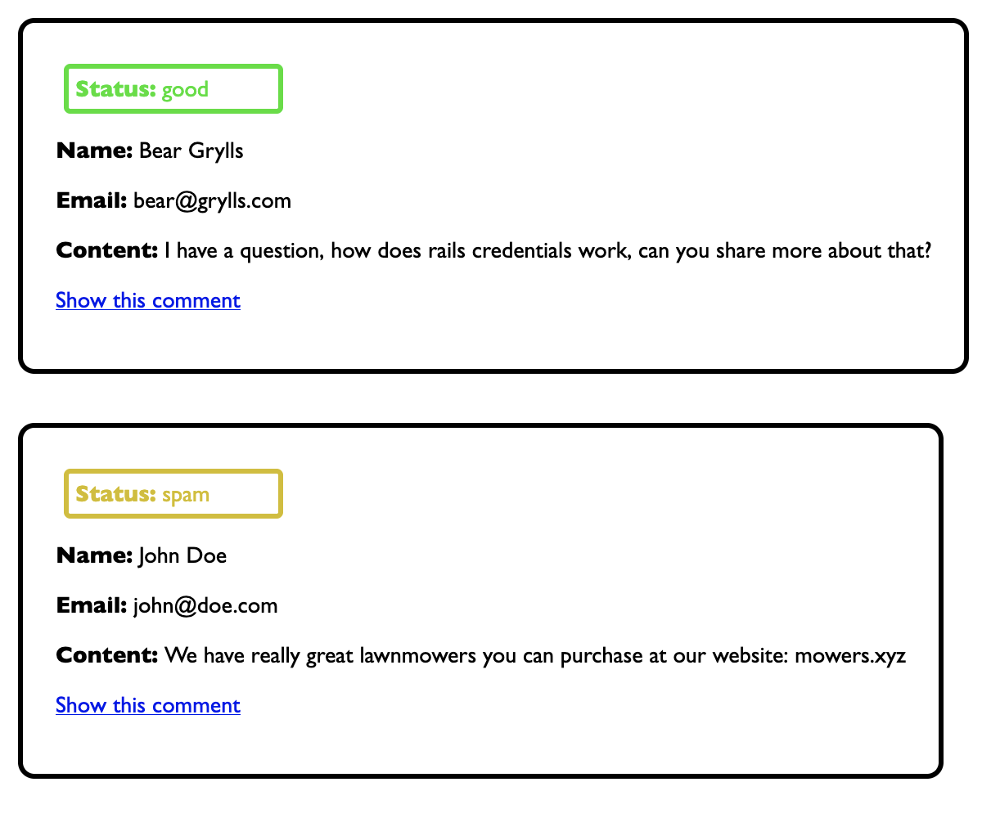

# goodchat

### Setup

Rails 8.0.2

Ruby version 3.3.0


### Configuration

1. Run the encrypted credential editor

`EDITOR='nano' rails credentials:edit -e=dev`

2. Set the mission control jobs credentials
```
mission_control:
  http_basic_auth_user: dev
  http_basic_auth_password: secret
```
After saving this and restarting the server you can view job dashboard at `localhost:3000/jobs`

3. After getting openai api dashboard access and creating a secret key, set your openai access token in `goodchat`

Run `EDITOR='nano' rails credentials:edit -e=dev` again and add this:

```
openai:
  secret_key: my-openai-key-here
```

### Database creation

`rails db:migrate`

`rails db:prepare`

### What does goodchat do?

Comment reviews with openai.



 An example for building public comments into a low profile site

### Services
`ReviewCommentJob`

three functions: send input to openai, update status, cleanup

